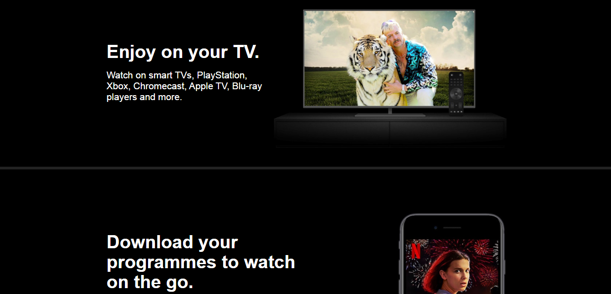
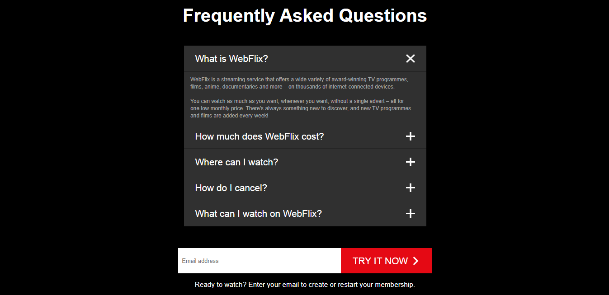
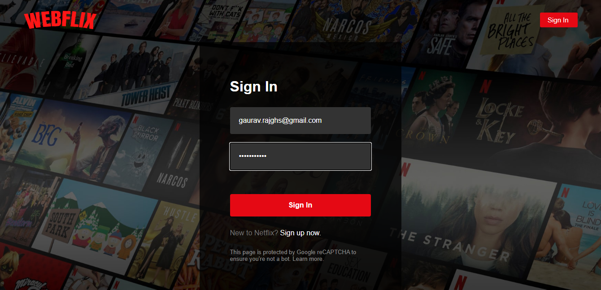
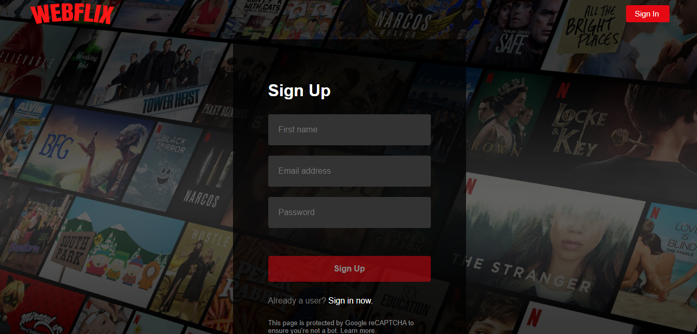

# WebFlix
- A replica of Netflix made using reactJS and firebase
- Hosted Website Link: https://webflix-by-raj.netlify.app/

## Developed By
Gaurav Raj - [LinkedIn](https://www.linkedin.com/in/gaurav-raj-5893b0195/)

## Features 
 - Browse page is restricted and can be accessed only after sign in.
 - Videos can be played live.
 - Live Search feature in browse page

## Look and feel of the site
- Home Page 

- Sign In and Sign Up Page

- Browse Page 

- View Movie details and play it Live

- Who's watching screen before Browse Page

